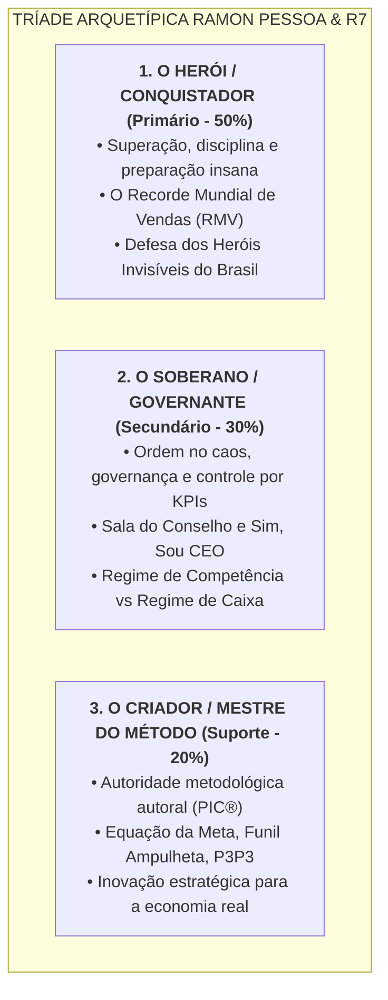

# Guia de Design System, Identidade de Marca & Universo Verbal — Ramon Pessoa, Grupo R7 & Programa Inteligência Comercial

> **Documento Canônico de Identidade, Design System e Metodologia**  
> **Perfil:** `ramon-pessoa` (Autoridade, Liderança e Voz do Fundador) & `r7-treinamentos` (Ecossistema Corporativo)  
> **Ativo Metodológico Protagonista:** **Programa Inteligência Comercial (PIC)®**  
> **Localização:** `/root/r7-marketing-hub/profiles/ramon-pessoa/context-docs/guia-design-system-identidade.md`  
> **Data de Atualização:** Setembro / 2026  
> **Fontes Canônicas:** Deck Oficial "Slides Programa Inteligência Comercial" (478 slides, ago/2026), *Raio-X — Ramon Pessoa*, *Raio-X do Cliente — R7 Treinamentos*, *Raio-X — Programa Inteligência Comercial* e Diretrizes de Produção do R7 Marketing Hub.

---

## Sumário Executivo do Guia

Este documento é a **bíblia visual, verbal e estratégica** para a concepção, design, redação e produção de qualquer ativo de marketing, landing page, apresentação executiva, criativo de mídia paga, materiais impressos ou animações em vídeo (Remotion / HyperFrames) do ecossistema de **Ramon Pessoa** e da **R7 Treinamentos / Grupo R7**, tendo como protagonista absoluto o **Programa Inteligência Comercial (PIC)**.

O objetivo central deste guia é blindar a marca contra a estética genérica de "infoproduto" ou "guru de internet", estabelecendo uma identidade de **classe executiva internacional**, fundamentada na autoridade de quem constrói na **economia real**, opera com metodologia proprietária comprovada e fala de empresário para empresário com rigor técnico, dados e energia implacável.

---

## 1. Visão Geral da R7 Treinamentos & Grupo R7

A **R7 Treinamentos** (operada institucionalmente sob a chancela **Grupo R7**) é uma das principais aceleradoras de negócios e escolas de liderança executiva do Brasil, sediada em Fortaleza/CE, fundada e liderada por **Ramon Pessoa**. Ela não é uma agência nem uma produtora de cursos genéricos: é uma organização dedicada a transformar pequenos e médios empresários da economia real em líderes estratégicos de alta performance através de imersões presenciais, programas de estruturação de 90 dias, mentorias de conselho e plataformas exclusivas de capacitação contínua.

```
                           GRUPO R7
                 (O Ecossistema Ramon Pessoa)
                              │
     METODOLOGIA CENTRAL: PROGRAMA INTELIGÊNCIA COMERCIAL (PIC)®
                              │
    ┌─────────────────────────┼─────────────────────────┐
    ▼                         ▼                         ▼
IMERSÕES & ACELERAÇÃO    ALTO TICKET & CONSELHO    FORMAÇÃO & COMUNIDADE
• PIC (Imersão 3 Dias)   • Estruturação Comercial   • R7 Academy (Plataforma)
• PlaneJá (Anual)          (Mentoria de 90 Dias)   • Comunidade Sim, Sou CEO
• IC Médico (Vertical)   • Sala do Conselho         • A RAMPADA (Movimento)
• RMV Experience           (R$ 60.000/ano)          • Bloco A/E (Scripts)
```

### 1.1 O Ativo Metodológico Central: Programa Inteligência Comercial (PIC)®
O ativo supremo e patrimônio intangível da R7 é o **Método Inteligência Comercial®** — corpo metodológico proprietário com marca registrada, vocabulário próprio e comprovado por métricas reais de faturamento. Todos os produtos e ofertas da R7 são formatos de entrega desse método.

* **Tese de Abertura:** *"Sem metas comerciais, a gente só trabalha para pagar boletos."*
* **Tese de Tração:** *"Se sua empresa não está crescendo, ela está morrendo. Ponto."*
* **Definição Oficial:** Metodologia que **une estratégia, vendas e gestão**. Não é treinamento raso de técnicas de vendas — é a arquitetura completa de um sistema comercial orientado a dados para a economia real.

### 1.2 Números Canônicos de Autoridade (Deck Oficial Ago/2026)
Estes são os números oficiais validados e assinados por Ramon Pessoa em sala executiva. Devem ser adotados em qualquer material institucional ou criativo:
* **+5.000** empresas impactadas com o Método Inteligência Comercial.
* **110** turmas da Mentoria de Inteligência Comercial realizadas.
* **+100 mil** alunos treinados no Brasil e no exterior.
* **408+** empresas mentoradas individualmente em diferentes mercados.
* **14 anos** de trajetória e liderança em gestão e vendas.

> **Regra de Consistência:** Não utilizar estimativas conflitantes da internet. Adotar estritamente os números acima, que constituem a base canônica mais recente, segura e auditável da R7.

### 1.3 O Público-Alvo (ICP — Perfil do Cliente Ideal)
* **Perfil Primário:** Donos, sócios e CEOs de PMEs da **economia real** (comércio varejista, distribuidores e atacadistas B2B, indústrias, clínicas médicas/saúde, construção civil, alimentação e prestadores de serviços).
* **Faturamento de Corte:** Empresas faturando a partir de **R$ 30.000/mês** até múltiplos milhões anuais.
* **A Dor Central:** O empresário "faz-tudo", sobrecarregado pela rotina operacional, refém de indicações passivas ou de um único vendedor, convivendo com faturamento imprevisível e sem processos claros de acompanhamento.

---

## 2. Quem é Ramon Pessoa: Trajetória, Autoridade & Personalidade

**Ramon de Paula Pessoa Sousa** — publicamente conhecido como **Ramon Pessoa**. Cearense, baseado em Fortaleza/CE, esposo de Sabrina Oliveira e pai de M. Crassos.

### 2.1 Trajetória de 14 Anos de Construção
* **Origem na Linha de Frente (~2012):** Construiu sua autoridade atuando diretamente na trincheira comercial da economia real, negociando e gerenciando equipes.
* **R7 Coaching e Origem do PlaneJá (~2015):** Fundou a R7 e criou o framework **PlaneJá**, pioneiro em planejamento estratégico anual para empresários (evento com mais de uma década de edições contínuas).
* **O Best-Seller "Sim, Sou Vendedor":** Escreveu e publicou a obra de referência que dignificou a carreira de vendas no mercado nacional, transformando o ato de vender em uma disciplina nobre e científica.
* **Formalização da R7 Treinamentos (2020):** Estruturou formalmente a expansão corporativa da R7, investindo no desenvolvimento de metodologias registradas e sistemas escaláveis de treinamento corporativo.
* **Criação do Programa Inteligência Comercial®:** Consolidou seu método autoral definitivo, aposentando qualquer resquício de "coaching" tradicional para assumir a bandeira da **arquitetura de sistemas comerciais, governança de métricas e inteligência de gestão**.
* **Internacionalização e Nível de Conselho (2025–2026):** Palestrante recorrente em eventos executivos internacionais em Orlando/FL (como o *Flip House Real Estate Experience*) para empresários brasileiros; criador da **Sala do Conselho (R$ 60k/ano)** e do **Programa de Estruturação Comercial de 90 Dias (R$ 30k)**.

### 2.2 O Arco Narrativo Transformador
> **De "Sim, Sou Vendedor" para "Sim, Sou CEO"**  
> Ramon é o espelho da evolução que ele conduz: o profissional que começa na execução comercial pura, aprende a estruturar processos matemáticos, implanta governança de dados e se torna o CEO estrategista que governa o crescimento da própria empresa.

### 2.3 Traços de Personalidade & Filosofia de Negócios
1. **Pragmatismo Implacável (Anti-Teoria Radical):** Aversão declarada a fórmulas mágicas, palestras de palco vazias e discursos acadêmicos descolados da prática. *"Aqui não tem enrolação: só o que funciona na economia real, com impacto imediato."*
2. **Obsessão por Acompanhamento Real:** Ramon afirma publicamente em sua premissa fundamental:
   $$\text{Acompanhamento Real} + \text{Ecossistema Certo} + \text{Conhecimento Aplicável}$$
3. **Mentalidade Olímpica & Disciplina:** Enxerga os negócios como esporte de alta performance competitiva. Bordão vivo: *"O segredo dos campeões é a preparação insana."* E ainda: *"Vontade todo mundo tem. Vontade extrema é para poucos."*
4. **Foco em Lucro e Caixa (Desprezo por Métricas de Vaidade):** Cunhou a máxima: *"Faturamento é vaidade, lucro é sanidade, caixa é rei."* Ele combate abertamente a ilusão de empresários que exibem faturamento bruto sem margem líquida real.
5. **As 4 Obsessões do Empresário de Alta Performance:**
   1. Lucro extraordinário
   2. Entrega UAU
   3. Gestão de classe mundial
   4. Faturamento é vaidade
6. **Liderança Vibrante e Fraterna:** Presença imponente, voz firme e inspiradora, com o grito de guerra clássico `#BoraPraCima`. Fala olhando nos olhos, chamando a responsabilidade do dono para liderar seu mercado.

---

## 3. Arquétipos de Marca & Posicionamento Psicológico

A identidade de Ramon Pessoa e da R7 Treinamentos é construída sobre uma tríade arquetípica de alto impacto:



### 3.1 Arquétipo Primário: O Herói / O Conquistador (The Hero) — 50%
* **Motivação:** Vencer desafios complexos, quebrar limites, combater a estagnação e resgatar quem carrega o país.
* **Manifestações:** O movimento dos **"Heróis Invisíveis do Brasil"** (as PMEs); o conceito de **Modelo Olímpico de Metas** e a celebração do **RMV (Recorde Mundial de Vendas)**; o chamado à **"preparação insana"**.
* **Tradução Visual:** Imagens contrastadas, iluminação dramática, enquadramentos firmes, linhas de alta energia e paleta com acentos de ouro/vitória.

### 3.2 Arquétipo Secundário: O Soberano / O Governante (The Ruler) — 30%
* **Motivação:** Estabelecer ordem, estrutura perene, estabilidade e excelência corporativa.
* **Manifestações:** Produtos como **Sala do Conselho** e **Sim, Sou CEO**; a separação contábil rigorosa entre Meta Comercial (Competência) e Meta de Gestão (Caixa); auditoria e controle de processos.
* **Tradução Visual:** Dark Navy profundo, tipografia sóbria e estruturada, grids rigorosos, acabamentos de classe executiva e cartões com bordas refinadas.

### 3.3 Arquétipo de Suporte: O Criador / Mestre do Método (The Creator) — 20%
* **Motivação:** Desenvolver soluções e sistemas originais com profundidade intelectual e aplicabilidade prática.
* **Manifestações:** A propriedade intelectual das **4 Bases**, a **Equação da Meta**, a matriz **P3P3**, o **Funil Ampulheta**, a **Fauna Comportamental** e o **Bloco A/E**.
* **Tradução Visual:** Blueprints organizados, diagramas vetoriais ortogonais de processos comerciais e tabelas de diagnóstico cirúrgico.

---

## 4. O Coração do Negócio: O Programa Inteligência Comercial (PIC)®

Esta seção consolida a totalidade da metodologia autoral criada por Ramon Pessoa, servindo como base técnica obrigatória para redação de copy, criação de criativos, roteiros de aulas e estruturação de interfaces.

```
┌────────────────────────────────────────────────────────────────────────┐
│              AS 4 BASES DO PROGRAMA INTELIGÊNCIA COMERCIAL             │
├─────────────────┬─────────────────────────┬────────────────────────────┤
│ VERBO DE AÇÃO   │ RÓTULO DE VENDA         │ EIXO TÉCNICO               │
├─────────────────┼─────────────────────────┼────────────────────────────┤
│ 1. ESTRUTURANDO │ Metas Lucrativas        │ Metas Comerciais & Equação │
│ 2. CONSTRUINDO  │ Receita Previsível      │ Funil de Vendas Ampulheta  │
│ 3. OTIMIZANDO   │ Crescimento Estratégico │ Growth, CAC & LTV          │
│ 4. CONTROLANDO  │ Performance Indicadores │ KPIs, Cadência & Follow-up │
└─────────────────┴─────────────────────────┴────────────────────────────┘
```

### 4.1 A Camada de Base: Os Fundamentos P3P3
Antes de subir as 4 Bases, a empresa precisa assentar seus fundamentos essenciais:
* **PESSOAS:** Alocação de talentos nos lugares certos, cultura de meritocracia, motivação e plano de desenvolvimento individual (PDI).
* **PROCESSOS:** Atividades correlacionadas e sequenciadas, sem gargalos manuais, com rotinas claras de passagem de bastão.
* **PRODUTOS / PROPÓSITO:** Soluções de alta qualidade (qualidade é obrigação, não diferencial), com margem lucrativa e capacidade de escala.

---

### 4.2 Base 1: Metas Lucrativas (ESTRUTURANDO)

> *"O que é uma meta comercial? É uma equação matemática composta com variáveis específicas e individuais para cada negócio."* — Ramon Pessoa

#### A Equação da Meta Comercial (As 10 Variáveis Determinísticas)
Meta não é chute motivacional de fim de ano. É o resultado do balanceamento de 10 variáveis reais:
1. **Capacidade Fabril / Operacional:** O limite físico ou de entrega da estrutura.
2. **Capacidade Humana:** O tamanho, a produtividade e a velocidade do time.
3. **Capacidade de Escala:** A capacidade de expansão sem quebra de qualidade.
4. **Tecnologia Usada:** Automações, sistemas e ferramentas de apoio.
5. **Sazonalidade:** As oscilações históricas do setor ao longo dos meses.
6. **Ticket Médio:** O valor médio transacionado por cliente.
7. **Investimentos:** O capital alocado em marketing, infraestrutura e expansão.
8. **Resultado do Ano Anterior:** O histórico validado da empresa.
9. **Inflação e Cenário Macroeconômico:** O impacto de custos e correção de preços.
10. **Crescimento Proposto:** O percentual estratégico pretendido pela liderança.

#### Separação por Regime Contábil: Meta Comercial × Meta da Gestão
* **Meta Comercial (Regime de Competência):** Direcionada aos vendedores. Mede o momento em que a venda é fechada, gerando incentivo e alinhando o esforço imediato da equipe.
* **Meta da Gestão (Regime de Caixa):** Direcionada à diretoria e saúde financeira. Mede o valor efetivamente faturado e recebido no caixa da empresa, garantindo pagamento de despesas, lucro e sobrevivência.

#### O Modelo Olímpico de Metas & O Nascimento do RMV
A metodologia estrutura a gamificação e a ambição comercial em 4 patamares:
```
           [ RMV — RECORDE MUNDIAL DE VENDAS ]
                 (O Ápice da Metodologia)
                            ▲
                     [ META OURO ]
                            ▲
                    [ META PRATA ]
                            ▲
                    [ META BRONZE ]
```
* **RMV (Recorde Mundial de Vendas):** O maior faturamento da história da empresa. É o troféu definitivo que valida a eficácia do método implantado.

#### Régua de Maturidade da Empresa
* **Bebê:** Sem histórico; opera com base em projeções e validações rápidas.
* **Adolescente:** Possui dados parciais, mas ainda oscila com incertezas e instabilidade.
* **Adulto:** Histórico consistente, processos maduros e controle comercial estabelecido.

---

### 4.3 Base 2: Receita Previsível (CONSTRUINDO)

#### O Conceito do Funil Ampulheta
O Programa Inteligência Comercial rejeita veementemente o funil tradicional que acaba na venda. O funil da R7 continua após a assinatura do contrato:

```
     ATRAÇÃO ───────── Visitantes / Reconhecimento
        │
   OPORTUNIDADE ────── Leads Qualificados / Consideração
        │
    CONVERSÃO ──────── Clientes / Decisão de Compra
        │
      VENDA ══════════ [ Ponto de Virada da Ampulheta ]
        ▼
     RETENÇÃO ──────── Fidelização e Satisfação do Cliente
     LEALDADE ──────── Upsell / Cross-sell / Recompra Recorrente
     INDICAÇÃO ─────── O Cliente como Embaixador Ativo
```

#### O Método FCJ: Funil, Canal e Jornada
* **Canais Omnichannel:** Mapeamento de canais de atuação (Inside Sales, Varejo, Distribuição B2B, Loja Física, E-commerce, Vendas Diretas, Eventos).
* **Jornadas Setoriais:** A R7 estrutura jornadas customizadas para Varejo, Atacado/Distribuição, Serviços e Clínicas de Saúde (vertical IC Médico).

#### As 4 Cadências Comerciais
1. **Cadência de Entrada:** Gestão de novos leads gerados por tráfego ou prospecção.
2. **Cadência de Agenda:** Conexão com leads para agendamento de reuniões e consultas.
3. **Cadência de Oportunidade:** Follow-up com propostas na mesa até o fechamento.
4. **Cadência de Base & Embaixadores:** Relacionamento contínuo para retenção e geração de indicações ativas.

---

### 4.4 Base 3: Crescimento Estratégico / Growth (OTIMIZANDO)

#### A Equação do Payback & Unit Economics
* **CAC (Custo de Aquisição do Cliente):** O valor real investido para trazer cada cliente pagante.
* **LTV (Lifetime Value):** O valor total que o cliente deixa na empresa ao longo de todo o tempo de relacionamento.
* **Equação de Saúde Financeira:**
  $$\text{Payback} = \frac{\text{CAC}}{\text{LTV}}$$

#### As 4 Frentes de Otimização de Margem
1. **Tráfego Qualificado:** Atração cirúrgica de leads aderentes ao ICP.
2. **Engajamento Ativo:** Interações focadas em solucionar a dor real do cliente.
3. **Conversão de Alta Eficiência:** Scripts de vendas orientados a valor e urgência.
4. **Retenção Sólida:** Atendimento UAU que previne o churn e estimula novas compras.

#### Gestão de Satisfação via NPS
* **Promotores (Notas 9-10):** Estimular depoimentos e programas formais de indicação.
* **Neutros (Notas 7-8):** Mapear melhorias operacionais para evitar perda para concorrentes.
* **Detratores (Notas 1-6):** Agir imediatamente para conter riscos à reputação da marca.

---

### 4.5 Base 4: Performance por Indicadores / KPIs (CONTROLANDO)

#### A Ciência do Follow-up: "O Follow-up é Rei"
O programa fundamenta a disciplina comercial em estatísticas contundentes do mercado brasileiro:
* **48%** dos vendedores nunca fazem um segundo contato.
* **25%** fazem apenas 2 contatos e desistem.
* **12%** fazem 3 contatos.
* Apenas **10%** realizam 4 ou mais contatos.
* **O Dado Chave:** **80% das vendas acontecem entre o 5º e o 12º contato.** Quem não possui cadência estruturada abandona 80% do faturamento na mesa.
* **Velocidade de Resposta:** Responder o lead em até **5 minutos** aumenta exponencialmente a probabilidade de contato efetivo.

#### Volumes de Atividades por Estágio
* **Lead Novo:** Até 30 atividades (ligações, WhatsApp, e-mails, abordagens multicanal).
* **Prospect:** 10 atividades de avanço e qualificação.
* **Cliente Ativo:** 5 atividades de acompanhamento e suporte.
* **Sucesso do Cliente (CS):** 5 atividades de relacionamento e pós-venda.

---

### 4.6 Gestão Comportamental de Equipes: A Fauna Comercial

Framework proprietário da R7 para recrutamento, seleção e alocação de times comerciais de alta performance:

```
┌────────────────────────────────────────────────────────────────────────┐
│                   A FAUNA COMERCIAL DA INTELIGÊNCIA COMERCIAL           │
├─────────────┬─────────────────────┬────────────────────────────────────┤
│ PERFIL      │ LEMA CENTRAL        │ PONTOS FORTES E COMPORTAMENTO      │
├─────────────┼─────────────────────┼────────────────────────────────────┤
│ TUBARÃO     │ "Fazer Rápido"      │ Urgência, foco em fechar, prático, │
│             │                     │ competitivo, voltado para ação.    │
├─────────────┼─────────────────────┼────────────────────────────────────┤
│ LOBO        │ "Fazer Certo"       │ Metódico, pontual, detalhista,     │
│             │                     │ segue regras, consistência pura.   │
├─────────────┼─────────────────────┼────────────────────────────────────┤
│ ÁGUIA       │ "Fazer Diferente"   │ Inovador, visionário, criativo,    │
│             │                     │ voltado a mudanças e futuro.       │
├─────────────┼─────────────────────┼────────────────────────────────────┤
│ GATO        │ "Fazer Junto"       │ Relacional, acolhedor, harmonia,   │
│             │                     │ voltado ao time e empatia.         │
└─────────────┴─────────────────────┴────────────────────────────────────┘
```

#### Alocação Estratégica por Cargo
* **CEO (Dono do Negócio):** Tubarão e Águia (Visão de futuro e velocidade de decisão).
* **Gerente Comercial:** Lobo e Tubarão (Disciplina de processo e foco em bater a meta).
* **SDR (Pré-vendas):** Tubarão (Volume, agilidade e persistência de contato).
* **Hunter (Prospecção / Fechamento Ativo):** Tubarão e Lobo (Agressividade com técnica).
* **Farmer (Pós-venda e Relacionamento):** Gato e Lobo (Cuidado, retenção e processo).

---

### 4.7 Framework de Diagnóstico: SIC × IC

Ferramenta mestra de contraste usada em diagnósticos, cartas de vendas e páginas de captura:

| Eixo de Análise | SIC — Sem Inteligência Comercial (Estado-Problema) | IC — Com Inteligência Comercial (Estado-Destino) |
|---|---|---|
| **Processos** | Desorganizados, baseados em improviso e sorte. | Otimizados, documentados e com rotinas claras. |
| **Metas** | Desejos aleatórios sem base matemática. | Equação calculada com base em 10 variáveis reais. |
| **Geração de Demanda** | Inconsistente, dependente de indicações passivas. | Previsível, omnichannel e ativa. |
| **Tomada de Decisão** | Baseada em intuição ("acho que vai dar"). | Baseada em KPIs, forecast e métricas de caixa. |
| **Follow-up** | Vendedor desiste no 1º ou 2º contato; leads frios. | Cadência multicanal com contato até o 12º ponto. |
| **Cultura de Time** | Reclamação, desculpas e vitimismo. | Foco em resultados, meritocracia e Modelo Olímpico. |
| **Resultado** | Estagnação, estresse do dono e risco de falência. | Escala sustentável, lucro no caixa e conquista do RMV. |

---

## 5. Universo Verbal & Diretrizes de Comunicação

### 5.1 O Tom de Voz
* **De Empresário para Empresário:** Ramon fala no mesmo nível do empresário. Conhece o peso de gerenciar estoques, pagar fornecedores e liderar colaboradores.
* **Assertivo, Impositivo e Convocador:** Uso constante do modo imperativo para gerar tração imediata: *"Assuma o comando"*, *"Calcule sua equação"*, *"Pare de queimar leads"*.
* **Alta Densidade de Dados:** Nenhuma promessa é vazia; toda tese é acompanhada de uma métrica ou de um estudo do método.
* **Energia Inabalável:** O entusiasmo não é ingênuo; é a certeza de quem tem um método testado e aprovado em mais de 5.000 empresas.

### 5.2 Expressões, Bordões e Assinaturas Canônicas

```
┌──────────────────────────────────────────────────────────────────────────┐
│ EXPRESSÕES E ASSINATURAS OBRIGATÓRIAS                                    │
├────────────────────────────────┬─────────────────────────────────────────┤
│ "Fala, empresário!"            │ Saudação de abertura em vídeos e copies │
│ #BoraPraCima                   │ Assinatura canônica de encerramento     │
│ RMV — Recorde Mundial de Vendas│ Métrica-troféu da metodologia           │
│ A RAMPADA                      │ O movimento em torno do RMV             │
│ "O follow-up é rei."           │ Axioma inegociável da Base 4            │
│ "Preparação insana."           │ A exigência para alcançar alta performance│
│ "Vontade extrema é para poucos"│ Convocação à postura executiva          │
│ "Faturamento é vaidade..."     │ "...lucro é sanidade, caixa é rei."     │
│ "Dois caminhos, uma decisão."  │ Encerramento binário clássico de oferta │
└────────────────────────────────┴─────────────────────────────────────────┘
```

### 5.3 Inimigos Declarados
1. **Eventos Teóricos & Gurus de Palco:** Palestras motivacionais que só geram euforia de fim de semana e não alteram o saldo bancário da empresa na segunda-feira.
2. **O Dono Refém da Operação:** O empresário que virou o melhor funcionário da própria empresa, sem tempo para a família ou para pensar estrategicamente.
3. **Métricas de Vaidade:** Curtidas, seguidores e faturamento bruto que não se convertem em margem líquida e dinheiro real no caixa.
4. **O Comodismo Perigoso:** Frases conformistas como *"pagando as contas já tá bom"*.

---

## 6. Design System Visual (Cores, Tipografia & UI)

A estética da R7 e de Ramon Pessoa é categorizada como **Executive Tech**: autoridade corporativa de classe mundial somada à clareza e dinamismo dos melhores produtos digitais globais.

```
┌────────────────────────────────────────────────────────────────────────┐
│                        PALETA EXECUTIVE TECH                           │
│                                                                        │
│   [DARK NAVY / SLATE]    +    [ROYAL BLUE]    +     [OLYMPIC GOLD]     │
│   Autoridade e Solidez       Ação & Tecnologia       Vitória & Recorde │
└────────────────────────────────────────────────────────────────────────┘
```

### 6.1 Paleta de Cores Oficial

#### Cores Primárias (Autoridade & Fundos Executivos)
* **Dark Navy (`#0A0F1D`):** Fundo absoluto, telas de apresentações executivas e superfícies imersivas.
* **Corporate Slate (`#0F172A`):** Cor de suporte para cards, seções alternadas e containers.
* **Card Slate (`#1E293B`):** Superfície elevada para cards de frameworks, modais e blocos de conteúdo.
* **Border Slate (`#334155`):** Divisórias estruturais elegantes de 1px.

#### Cores de Ação & Método (Accent Primário)
* **Royal Blue (`#2563EB`):** A cor primária de conversão, botões de ação principal, badges das 4 Bases e realces interativos.
* **Deep Blue (`#1D4ED8`):** Estado de hover e acabamento de gradientes escuros.
* **Electric Cobalt (`#3B82F6`):** Linhas de diagramas de fluxo, glows suaves e ícones ativos.

#### Cores de Conquista & Premiação (Ouro RMV)
* **Olympic Gold (`#F59E0B`):** Destaque exclusivo do **RMV (Recorde Mundial de Vendas)**, troféus e marcos extraordinários.
* **Noble Amber (`#D97706`):** Degraus do Modelo Olímpico (Ouro/Bronze) e selos de validação.
* **Light Gold (`#FBBF24`):** Realces de texto e badges premium.

#### Superfícies de Leitura & Contraste
* **Pure White (`#FFFFFF`):** Textos de alto contraste e fundo obrigatório para cápsulas de marcas parceiras (`.plate`).
* **Executive Off-White (`#F8FAFC`):** Fundo padrão para relatórios e materiais de leitura impressa.
* **Muted Gray (`#94A3B8`):** Textos secundários, legendas técnicas e labels de suporte.

#### Cores Semânticas de Diagnóstico (SIC × IC)
* **Alerta / Erro / SIC (`#EF4444` / Crimson `#DC2626`):** Gargalos, processos rompidos e estado problemático Sem Inteligência Comercial.
* **Sucesso / Lucro / IC (`#10B981` / Emerald `#059669`):** Metas batidas, alta performance e processos Com Inteligência Comercial.

### 6.2 Tipografia & Hierarquia Escalar

```
┌────────────────────────────────────────────────────────────────────────┐
│ HEADLINES & TÍTULOS:   Poppins (Bold 700 / ExtraBold 800 / Black 900)  │
│ SUBTÍTULOS & CARDS:    Poppins (SemiBold 600) / Inter (SemiBold 600)   │
│ CORPO & TEXTO LONGO:   Inter (Regular 400 / Medium 500)                │
│ MÉTRICAS & KPIS:       Poppins (Black 800/900) / JetBrains Mono (Bold) │
│ LABELS, TAGS & CÓDIGO: JetBrains Mono (Medium 500 / All Caps)          │
└────────────────────────────────────────────────────────────────────────┘
```

#### Diretrizes Tipográficas
* **Headlines de Alto Impacto:** Poppins em peso 700 ou 800, tracking suavemente negativo (`-0.02em` a `-0.03em`), transmitindo peso e certeza.
* **Corpo de Texto Confortável:** Inter em peso 400 ou 500, line-height equilibrado (1.5 a 1.6), cor `#E2E8F0` em fundos escuros e `#334155` em fundos claros.
* **Rótulos Metodológicos e Tags:** JetBrains Mono em caixa alta (All Caps) com tracking aberto (`0.08em` a `0.12em`), para indicar rigor analítico (ex.: `BASE 1 // METAS COMERCIAIS`, `METODOLOGIA PIC®`).

### 6.3 Iconografia & Grafismos Metodológicos
* **Ícones:** Traço vetorial minimalista com espessura uniforme de 2px (estilo **Lucide Icons**). Jamais utilizar ícones coloridos infantis ou caricaturais.
* **Conectores de Processo SVG:** Linhas ortogonais com bordas arredondadas e traço limpo, sempre posicionadas atrás dos cards estruturais.
* **Cápsula de Proteção de Marcas (`.plate`):** Nunca aplicar logotipos ou selos com transparência diretamente sobre fundos escuros complexos. Utilizar cápsulas brancas com contraste impecável.
* **Grafismos Proprietários Obrigatórios:**
  * Pódio Olímpico de 4 degraus culminando no troféu do RMV.
  * O Funil Ampulheta com visualização clara das etapas de pré e pós-venda.
  * A régua das 4 Bases no rodapé de materiais executivos.

---

## 7. Direção de Arte & Fotografia de Ramon Pessoa

A autoridade visual de Ramon Pessoa deve transmitir solidez executiva, energia ativa e liderança inspiradora.

### 7.1 Postura, Olhar e Expressão
* **Olhar Fixo e Confiante:** Conexão direta com a câmera, demonstrando franqueza, segurança e foco no interlocutor.
* **Expressão Real:** Expressão focada, séria e serena. Evitar sorrisos forçados ou poses estáticas engessadas.
* **Gestos em Ação:** Fotografias de palco em movimento, gesticulando com energia ou apontando para os frameworks no telão.

### 7.2 Figurino (Smart Casual Executivo de Alto Padrão)
* Camisetas básicas pretas ou chumbo de algodão nobre e caimento impecável.
* Blazers contemporâneos escuros de corte alinhado, combinados com calças de alfaiataria sóbrias.
* Camisas sociais escuras com as mangas dobradas na altura do antebraço (transmitindo prontidão para o trabalho).
* Ausência total de ostentação vulgar (proibido correntes grossas ou relógios espalhafatosos).

### 7.3 Iluminação e Cenários
* **Iluminação de Cinema:** Contraste suave estilo chiaroscuro, com luz de recorte fria/azulada nos ombros (*rim light*) para destacar a silhueta sobre o fundo Dark Navy.
* **Cenários Ideais:**
  * *Auditório / Palco da Imersão:* Ramon no centro do palco iluminado, com plateia atenta e telão ao fundo exibindo os slides do PIC.
  * *Sala Executiva de Conselho:* Mesa de reunião nobre, luz sóbria, cadernos de anotações estratégicas e foco em análise de dados.
  * *Mesa de Mentoria 1:1:* Ramon analisando planos comerciais e conversando diretamente com empresários mentorados.

---

## 8. Diretrizes de Produção Audiovisual (Remotion & HyperFrames)

```
┌────────────────────────────────────────────────────────────────────────┐
│ DOUTRINA AUDIOVISUAL R7 MARKETING HUB                                  │
├───────────────────┬────────────────────────────────────────────────────┤
│ Remotion          │ Vídeos narrativos master, pitch decks dinâmicos,   │
│ (React-based)     │ animações de dashboards e frameworks em 1920×1080. │
├───────────────────┼────────────────────────────────────────────────────┤
│ HyperFrames       │ Motion graphics rápidos em HTML/GSAP, vinhetas,    │
│ (HTML/GSAP native)│ kinetic typography para Reels/Shorts (9:16).       │
├───────────────────┼────────────────────────────────────────────────────┤
│ Áudio & Voz       │ Locução executiva calibrada a -14 LUFS (48kHz),    │
│                   │ com respiro de exatamente 18 frames após a fala.   │
└───────────────────┴────────────────────────────────────────────────────┘
```

* **Canvas & Proporções:** Master 1920×1080 com escalabilidade adaptativa via código (`Math.min(width / 1920, height / 1080)`).
* **Física Amortecida:** Movimentos elegantes e firmes (`damping: 20`, `mass: 0.5`). Proibido efeitos de elástico ou rebote infantil.
* **Camera Drift:** Movimento suave de câmera 3D com deslocamento de no máximo 2% a 4%, gerando tridimensionalidade sóbria.
* **Kinetic Typography:** Palavras-chave dos bordões de Ramon destacadas em caixas sólidas em Royal Blue ou Gold, com alinhamento rigoroso ao áudio da narração.

---

## 9. Aplicações por Meio & Checklist de Validação

### 9.1 Aplicações por Canal
1. **Landing Pages e Aplicações Web:** Foco total em conversão sem fricção. Seções Hero com headline impositiva em Poppins 800, badge técnico superior em JetBrains Mono, foto de Ramon em alta resolução e formulários fluidos com barra de progresso em Royal Blue.
2. **Decks de Apresentação (Slides PIC):** Formato 16:9 widescreen, com a premissa de *um conceito por slide*. Rodapé permanente contendo o lembrete das 4 Bases e fórmulas apresentadas em contraste absoluto para visualização à distância.
3. **Relatórios e Diagnósticos Técnicos:** Layout executivo A4 em alta resolução (300 DPI), com o cabeçalho oficial do Grupo R7, gráfico do Termômetro da Base Rompida e o roadmap das ações recomendadas para o alcance do RMV.
4. **Criativos de Mídia Paga:** Ganchos contundentes nos primeiros 3 segundos de vídeo, imagens estáticas com tipografia de alta densidade e chamadas diretas para a quebra de estagnação comercial.

---

### 9.2 Checklist de Validação: "The Ramon Test"

Antes de enviar para publicação qualquer peça gráfica, página, copy ou vídeo, execute a validação:

```
┌────────────────────────────────────────────────────────────────────────┐
│ MATRIZ DE VALIDAÇÃO: "THE RAMON TEST"                                  │
├──────────────────────────────────────────────────────────────────┬─────┤
│ 1. SOa COMO RAMON PESSOA?                                        │     │
│    A comunicação é direta, imperativa, de empresário para        │ [ ] │
│    empresário, sem enrolação e com energia executiva?            │     │
├──────────────────────────────────────────────────────────────────┼─────┤
│ 2. RESPEITA A ECONOMIA REAL?                                     │     │
│    O conteúdo trata de vendas reais, caixa, equipes e lucro      │ [ ] │
│    líquido (e não de fórmulas mágicas da internet)?              │     │
├──────────────────────────────────────────────────────────────────┼─────┤
│ 3. OS NÚMEROS SÃO OS CANÔNICOS OFICIAIS?                         │     │
│    Utiliza estritamente +5.000 empresas, 110 turmas,             │ [ ] │
│    +100k alunos treinados, 408 mentorias e 14 anos?              │     │
├──────────────────────────────────────────────────────────────────┼─────┤
│ 4. O PROGRAMA INTELIGÊNCIA COMERCIAL É PROTAGONISTA?             │     │
│    A terminologia das 4 Bases, P3P3, Modelo Olímpico e RMV       │ [ ] │
│    está corretamente grafada e explicada?                        │     │
├──────────────────────────────────────────────────────────────────┼─────┤
│ 5. AS DIRETRIZES VISUAIS ESTÃO PRESERVADAS?                      │     │
│    Paleta Dark Navy (#0A0F1D), Royal Blue (#2563EB) e Gold?      │ [ ] │
│    Tipografia em Poppins e Inter? Cápsulas .plate em logos?      │     │
└──────────────────────────────────────────────────────────────────┴─────┘
```

Estando todos os itens em conformidade, o ativo está formalmente validado e pronto para veiculação no ecossistema **Ramon Pessoa & Grupo R7**.
